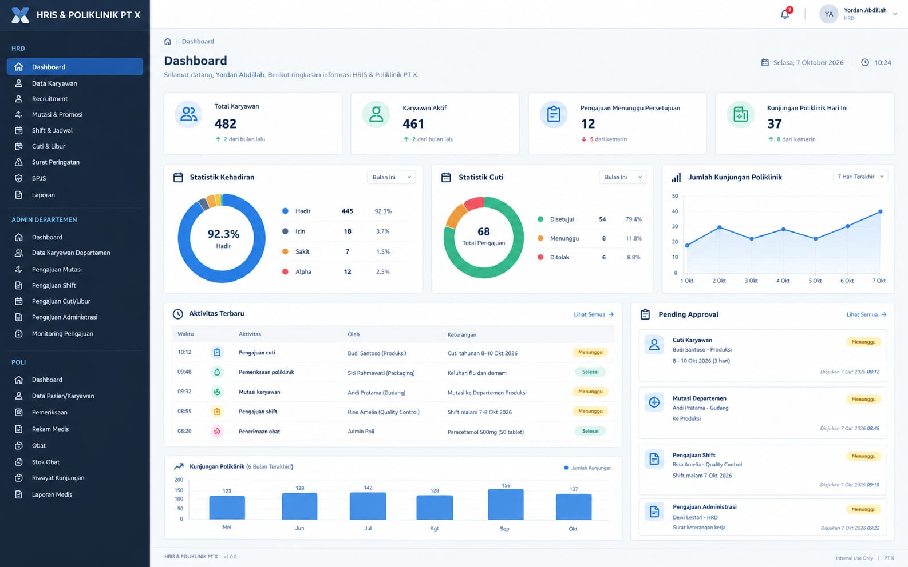

# Visi: Platform HRIS + Absensi + Payroll + Poliklinik — LAN, 3.000+ karyawan

Bukan sekadar CRUD karyawan, tetapi **platform HRIS jangka panjang**. Browser → server LAN → Python (Django) → PostgreSQL.
Database tidak pernah di komputer client.

> **Riwayat dokumen.** Versi ini menggabungkan visi awal dengan *Spesifikasi HRMS & Poliklinik PT X* (role, dashboard, SP, MCU,
> recruitment, meal, laporan/ekspor, dst.). **Dari spesifikasi hanya fitur/kebutuhannya yang diambil; platform tetap Django (tanpa Odoo).**
> Gambar dashboard (`docs/ui-reference/dashboard-hrd.png`) dipakai **hanya sebagai rujukan tampilan** agar UI/UX rapi dan ramah pengguna;
> fitur ditentukan oleh visi ini, bukan oleh isi gambar. Bagian bertanda **[BARU]** berasal dari penggabungan; keputusan dicatat di "Keputusan penyelarasan".

> **Pembaruan 8 Oktober 2026.** Ditambahkan (bertanda **[BARU]**): tombol ikon tema terang/gelap · Rekap Seragam · Validasi kehadiran
> HRD → Admin Departemen · format rupiah tanpa ",00" · menu BPJS (Ketenagakerjaan/Kesehatan) + rekap potongan + impor/ekspor XLSX ·
> Tagihan Mitra untuk Poli · bagian "Kemungkinan / belum diputuskan" (role Payroll & IT) · pertahanan keamanan berlapis · strategi skalabilitas.
> Butir yang sudah ada sebelumnya tidak diduplikasi, hanya dirujuk. Komponen baru keamanan/skalabilitas **disetujui pemilik produk**; angka ambang/sasaran yang bertanda *usulan* masih dapat disetel.

> **Pembaruan 9 Oktober 2026 (putaran 21).** Keputusan yang kini tercermin di visi: (1) **kebijakan dependensi** — hanya memakai cabang Django/paket yang masih didukung vendor
> dan menjalankan `pip-audit` tiap rilis (Django 5.1 ditinggalkan karena 8 kerentanan tanpa perbaikan; sekarang 5.2 LTS); (2) **keamanan dibangun berlapis dan bertahap**: kunci akun per username,
> throttle per zona, timeout idle, CSP/header, kebijakan sandi sudah ada; **CSP tanpa `'unsafe-inline'` (nonce), 2FA, ClamAV, kunci per username+IP** tetap tujuan; (3) **format rupiah dan tema ikon**
> sudah menjadi komponen bersama — semua halaman/ekspor baru (BPJS, Seragam, Tagihan Mitra) wajib memakainya; (4) jalur login mana pun (termasuk `/admin/login/`) harus lewat kontrol yang sama
> (celah `/admin/login/` tanpa rate limit ditutup). Rincian status: `docs/PROGRESS.md` → putaran 21.

> **Pembaruan 10 Oktober 2026 (putaran 30).** (1) **Prinsip UI/UX berbasis fungsi** (bagian baru di bawah) — setiap halaman harus menjawab "apa langkah berikutnya?" dan tidak boleh meniru gaya generik/dekoratif;
> halaman Seragam dan daftar Pengajuan dirapikan sebagai contoh. (2) **Pengajuan Stand By (kerja saat waktu istirahat) & Lembur** dari Admin Departemen (mis. Admin Produksi) ke HRD — bagian baru di bawah.
> (3) **Tahap 11 (terakhir): Company Profile + Lamar Kerja** — perluasan scope yang dibuka sebagai situs publik terpisah dari aplikasi internal; keamanan, stabilitas, fleksibilitas, dan kemudahan bagi pelamar menjadi syarat. Status: `docs/PROGRESS.md` → putaran 30.

## Role
| Role | Cakupan |
|---|---|
| Superadmin | Semua: user, role, permission, master, konfigurasi sistem, audit, backup, pengaturan perusahaan (nama, logo, alamat, kontak, tahun berjalan) |
| HRD | Dashboard HRD, karyawan, struktur organisasi, departemen, jabatan, grade, status kepegawaian, shift, kontrak, mutasi/promosi, tukar shift, izin/cuti/libur, absensi, **surat peringatan**, BPJS (**submenu Ketenagakerjaan/Kesehatan + rekap potongan**), **seragam**, **validasi kehadiran**, **recruitment**, informasi, laporan, monitoring pengajuan, **halaman Operasional HRD** (bantuan, cuti hamil, kerja harian proyek, katering/meal, status BPJS) |
| Admin Departemen (±20) | Hanya departemennya: lihat karyawan, konfirmasi absensi (**atas permintaan HRD**, lihat "Validasi kehadiran"), **mengajukan** mutasi/izin/cuti/tukar shift/tukar libur/**administrasi**/**stand by & lembur**, memantau status & riwayat pengajuan, terima informasi HRD. Tanpa CRUD master, data sensitif, data medis, tanpa approve, tanpa mengubah BPJS bebas |
| Poli (Medis) | Identitas minimum karyawan + seluruh modul poliklinik (pemeriksaan, rekam medis, diagnosis, tindakan, obat, stok, MCU, laporan medis, **tagihan mitra**) |
| Employee | **Bukan role/login.** Data dikelola HRD; pengajuan lewat Admin Departemen **[BARU, dikonfirmasi]** |

> **Role tambahan (Payroll, IT)**: mungkin diterapkan, mungkin tidak — lihat "[BARU] Kemungkinan / belum diputuskan". Desain role harus tetap memungkinkan penambahan tanpa mengubah struktur data.

## Keamanan
RBAC + **department scope di backend/query** (ubah ID di URL → 404). Data sensitif/medis hanya role berwenang.
Password hash, rate limit login, CSRF, validasi input, session aman, audit log, soft delete untuk data penting.
Data medis wajib berpembatasan akses (karena sensitif). **[BARU]** Hak akses akhirnya berbasis aksi — *View · Create · Edit · Delete · Approve · Reject · Export · Print* —
per role (saat ini masih per role + scope; matriks per aksi dikerjakan bertahap, lihat A7 di PROGRESS).

### [BARU] Pertahanan berlapis (banjir request, brute force, dan serangan umum)
Prinsip: **tidak ada satu lapisan yang diandalkan sendirian.** Lapisan luar (firewall/Nginx) menahan beban sebelum menyentuh Django; lapisan aplikasi menahan
penyalahgunaan per akun; lapisan data membatasi dampak bila ada yang lolos. Angka di bawah adalah **usulan awal**, disetel lewat konfigurasi setelah diuji.

| Ancaman | Kontrol |
|---|---|
| **Terlalu banyak request** (flood/DoS dari satu IP, skrip rusak, klien salah) | Nginx `limit_req` + `limit_conn` per IP dengan zona terpisah (login sangat ketat · API/daftar sedang · ekspor/unduh/unggah ketat); batas ukuran body dan timeout. Di aplikasi: throttling per user **dan** per IP memakai **cache bersama (Redis)** agar berlaku lintas worker (cache per proses tidak cukup bila worker > 1). Jawaban **429 + `Retry-After`**, tercatat. Timeout dan jumlah worker gunicorn dibatasi agar satu endpoint lambat tidak menghabiskan semua worker; pekerjaan berat dialihkan ke antrean (lihat Skalabilitas) |
| **Terlalu banyak login / brute force / credential stuffing** | Pembatasan **per IP dan per username** (satu orang tidak mengunci semua, tetapi satu akun juga tidak bisa ditebak terus-menerus); jeda bertambah progresif; akun terkunci sementara setelah N kali gagal dan dapat dibuka Superadmin; pesan galat **sama** untuk username salah dan sandi salah (tidak membocorkan akun yang ada); kebijakan sandi (panjang minimum, sandi umum ditolak); **2FA (TOTP)** bertahap — wajib untuk Superadmin, lalu HRD/Poli; notifikasi ke Superadmin saat lonjakan gagal login; login gagal/terkunci tercatat di audit |
| **Pengambilalihan sesi / penyadapan** | Cookie `HttpOnly`/`Secure`/`SameSite`; **timeout idle**; sesi diputus saat ganti/reset sandi (sudah ada); ID sesi diganti saat login; opsi batasi sesi bersamaan; **TLS juga di LAN** (sertifikat CA internal) supaya sandi dan sesi tidak terbaca di jaringan |
| **Injeksi & skrip** (SQLi, XSS, CSRF, clickjacking) | ORM tanpa SQL mentah dari input; keluaran di-escape / `textContent` (sudah ada); CSRF (sudah ada); **CSP ketat** (mudah karena tanpa CDN); `frame-ancestors`/`X-Frame-Options`, `nosniff`, `Referrer-Policy`, HSTS bila HTTPS; sel berawalan `=`/`@` ditolak/dinetralkan di impor-ekspor (sudah ada) |
| **Akses antar-data yang tidak sah** (IDOR, eskalasi hak) | Scope di backend (ubah ID → 404, sudah ada); permission per aksi (A7); tes RBAC otomatis setiap URL × role; **tinjauan hak akses berkala** (Superadmin meninjau daftar user & role tiap kuartal); hak minimum, termasuk untuk role Payroll/IT bila diterapkan |
| **Unggahan berbahaya** | Ekstensi + magic bytes + ukuran (sudah ada), nama berkas uuid, unduh lewat view ber-izin (sudah ada); tambahan **pemindai antivirus (ClamAV)**; satu helper validasi untuk semua jalur unggah (lampiran pengumuman, tagihan mitra, dokumen) |
| **Kebocoran data massal** (orang dalam, akun dibajak) | Ekspor data sensitif hanya role berwenang dan diaudit (sudah ada); **kuota + rate limit ekspor**; peringatan otomatis untuk pola janggal (ekspor besar berulang, akses di luar jam kerja, banyak 403/404 beruntun = pemindaian); enkripsi kolom (sudah ada) dan keputusan enkripsi data medis (A12); nilai sensitif tidak masuk log |
| **Pemindaian & serangan jaringan** | Firewall: hanya 80/443 dari subnet yang diizinkan; PostgreSQL hanya di **localhost/socket**, tidak terjangkau dari LAN; SSH hanya kunci; **fail2ban** membaca log Nginx/aplikasi dan memblokir IP; segmentasi VLAN; Career Portal di host terpisah (sudah ada di keputusan #8) |
| **Kelemahan komponen** (dependensi, konfigurasi) | `manage.py check --deploy`; pembaruan dependensi berkala + `pip-audit`; analisis statis (`bandit`) di pengujian; rahasia hanya di `.env` (tidak di repo); `DEBUG=False`; akun layanan hak minimum |
| **Perusakan / ransomware / kehilangan data** | Backup terenkripsi, **salinan di lokasi lain yang tidak dapat ditimpa dari server utama** (immutable/offline), uji restore terjadwal, kunci enkripsi disimpan terpisah; audit log append-only (sudah ada) + salinan ke host log terpisah |
| **Insiden** | Runbook singkat (siapa memutus akses, memutar kunci/sandi, memulihkan), retensi log, latihan berkala |

> **Pembaruan 9 Oktober 2026 (putaran 22).** (1) **Potongan BPJS** kini ada sebagai tabel sendiri dengan rekap per periode, input manual, impor/ekspor CSV/XLSX, dan dua arah anomali —
> angka berasal dari **impor/input** dulu, **hitung dari master tarif** menunggu Payroll; (2) prinsip yang dipertahankan dari paket ini untuk semua paket berikutnya: **satu form untuk input dan impor**,
> ekspor **tanpa nomor identitas/BPJS** dan tercatat di audit, hal janggal **ditandai, bukan diblokir** bila ada alasan sah (mis. potongan gaji terakhir karyawan nonaktif); (3) Superadmin kini
> **diberi tahu** saat akun terkunci. Status rinci & sisa: `docs/PROGRESS.md` → putaran 22.

> **Pembaruan 9 Oktober 2026 (putaran 25).** Seragam kini juga **stok**: barang masuk (vendor), keluar otomatis saat pembelian dicatat, kembali saat dibatalkan, koreksi beralasan, kartu stok append-only; rekap ukuran diganti rekap stok. Tautan antarmuka dirapikan lewat komponen bersama (`.back`, `.tools`, `.chip`, `.exports`) — halaman baru wajib memakainya. Tombol Jadwal mingguan dihapus dari Data Karyawan.

> **Pembaruan 9 Oktober 2026 (putaran 23).** (1) **Menu BPJS** kini lengkap sejauh tidak bergantung Payroll: sidebar BPJS dengan submenu Kesehatan/Ketenagakerjaan, ringkasan per departemen; (2) **Rekap Seragam** ada sebagai
> halaman HRD (pembelian + ukuran, tarif L/P berlaku-sejak yang **disalin ke baris**, rekap per ukuran × jenis kelamin untuk pesanan vendor, impor/ekspor); (3) prinsip baru untuk semua paket berikutnya:
> **ekspor uang berupa angka ber-format (bisa dijumlah), bukan teks**; **catatan transaksi tidak diedit/dihapus** — koreksi lewat pembatalan beralasan; **tarif/master berlaku-sejak bersifat append-only dan disalin ke transaksi**;
> **data historis disalin saat dicatat** (mis. jenis kelamin) agar laporan lama tidak bergeser. Status rinci & sisa: `docs/PROGRESS.md` → putaran 23.

> **Pembaruan 9 Oktober 2026 (putaran 24).** **Tagihan Mitra** (Poli) kini ada: master mitra, tagihan beridentitas karyawan dengan **keluhan terenkripsi** dan diagnosa dari master, alur
> diterima → diverifikasi → disetujui → dibayar / ditolak (alasan wajib) dengan **jejak append-only**, rekap per mitra/departemen/diagnosa/karyawan/status, impor, dan **dua ekspor** — ringkasan tanpa data medis dan lengkap (medis).
> Prinsip yang ditegaskan untuk modul data-medis berikutnya (MCU, register kehamilan): **kolom medis baru dienkripsi sejak awal**; isi medis **tidak pernah** masuk audit (hanya penanda) — uji dengan kata kunci unik di seluruh `AuditLog`;
> **membuka** data medis beridentitas tercatat; ekspor dipisah "ringkasan" vs "medis". Status rinci & sisa: `docs/PROGRESS.md` → putaran 24.

### Status & prinsip tambahan (putaran 21)
- **Satu pintu kontrol untuk semua jalur masuk**: kunci akun, rate limit IP, dan audit berlaku sama di `/login/` dan `/admin/login/`; jalur baru apa pun (API token, SSO kelak) wajib melewati `authenticate()` yang sama.
- **Pesan seragam**: login gagal, akun terkunci, dan username tak dikenal tampil identik (tidak membocorkan keberadaan akun). Kunci akun **selalu sementara** dan dapat dibuka Superadmin; tiap penguncian tercatat di audit.
- **Halaman data pribadi/medis tidak boleh tersimpan di cache peramban** (`Cache-Control: no-store` untuk user login). Sesi berakhir saat tidak aktif (bawaan 30 menit, dapat disetel).
- **Ambang adalah konfigurasi, bukan kode** (`.env`): batas login, timeout idle, HSTS bertahap, Redis opsional. Tanpa Redis, batas hanya berlaku per proses → produksi multi-worker **wajib** Redis.
- **Setiap kontrol baru diuji dengan uji mutasi** (merusak aturan lalu memastikan tes gagal) — kebiasaan yang dipertahankan untuk paket berikutnya.

## Prinsip data
- Jangan menimpa data lama: simpan **histori** departemen, jabatan, grade, lokasi, status, shift, kontrak, organisasi, mutasi, pendidikan, pekerjaan sebelumnya.
- Workflow: `Draft → Submitted → Pending Approval → Approved/Rejected → Executed` (Executed = update master + histori otomatis); `Cancelled` untuk pembatalan.
- Tukar shift/libur: master shift tidak berubah sebelum disetujui (dan tidak pernah berubah oleh tukar; hanya jadwal per tanggal).
- Obat memakai **kartu stok** (masuk/keluar/saldo), obat keluar lewat rekam medis; **[BARU]** tambahan: retur, stock opname, kedaluwarsa/lot.
- Data payroll **tidak dicampur** ke tabel karyawan.
- Audit: user, waktu, IP, module, action, data sebelum/sesudah.
- BPJS adalah bagian data karyawan (master pada profil), **tanpa workflow pengajuan/approval**.

## Shift, jadwal & tukar shift/libur  **[BARU]**
**Master shift** (`/master/shift/`): nama, **kode** (PAGI, SIANG, MALAM, GS-12, GS-14, GS-16), jam masuk/pulang, melewati tengah malam, **GS** (general shift, tidak ikut rotasi kelompok), **aktif** (nonaktif = tidak ditawarkan lagi di form, histori tetap).
**Kelompok rotasi** (sumber: `docs/jadwal_shift_2026.md`): pola **2 shift** (**A–G**; Pagi–Siang; 3 Pagi + 3 Siang + 1 Libur per hari) dan pola **3 shift/PACK** (**A_pack–G_pack**; Pagi–Siang–Malam; 2+2+2+1 per hari). `A` ≠ `A_pack`: dua kelompok berbeda walau hurufnya sama. Jam: Pagi 06–14, Siang 14–22, Malam 22–06; GS 08–16 (GS-14 / GS-12 hanya pada hari kerja sebelum libur GS).
**General Shift (GS)**: semua karyawan GS **08:00–16:00** (GS-16). Pada hari kerja **tepat sebelum hari libur GS** jam pulang dipersingkat: sebagian **GS-14 (08–14)**, sebagian **GS-12 (08–12)** (dipilih per karyawan, `gs_short`).
**Sumber jadwal dasar karyawan = salah satu**: kelompok rotasi **atau** shift tetap/GS (tidak keduanya).
**Jadwal efektif** pada tanggal D (urutan prioritas): ① penyesuaian hasil tukar yang sudah dilaksanakan (per tanggal) → ② rotasi kelompok → ③ shift tetap/GS (Minggu libur reguler). Master (`Employee.shift`, `shift_group`) **tidak pernah diubah oleh tukar**.

**Tukar shift/libur — dua mode** (satu pengajuan, satu persetujuan HRD, dilaksanakan **bersama atau tidak sama sekali**):
| Jenis | 1 orang (menukar sendiri) | 2 orang (dengan rekan) |
|---|---|---|
| Tukar shift | pindah ke shift lain pada tanggal itu (hari kerja) | pada satu tanggal keduanya sama-sama masuk dengan shift **berbeda** → shift saling ditukar |
| Tukar libur | memindahkan **liburnya sendiri**: tanggal libur → masuk, hari kerja lain → libur | libur **saling ditukar**: pada tanggal 1 pemohon libur & rekan masuk, pada tanggal 2 rekan libur & pemohon masuk → pemohon masuk di shift rekan (tgl 1), rekan masuk di shift pemohon (tgl 2) |
Aturan: tanggal tidak lampau; tidak bentrok dengan tukar lain (baik sebagai pemohon **maupun rekan**) atau penyesuaian yang sudah ada; tidak jatuh pada izin/cuti/sakit (kedua orang); Admin Departemen hanya boleh memilih rekan dari departemennya (HRD lintas departemen); aturan yang sama diperiksa ulang saat **Laksanakan** karena kondisi bisa berubah sejak diajukan.
**Menu:** tidak ada submenu “Jadwal Shift”; jadwal ada di detail karyawan, dan jadwal mingguan dibuka dari Data Karyawan.
**Impor & ekspor:** CSV/XLSX untuk karyawan, master (departemen, jabatan, shift), tabel rotasi, obat, diagnosa; ekspor jadwal, saldo cuti, pengajuan, rekap stok, audit. Semua impor divalidasi dengan aturan form yang sama, semua-atau-tidak-sama-sekali.
**Sudah ada:** jadwal mingguan per departemen `/schedule/` dan notifikasi saat tukar dilaksanakan (pemohon + Admin Departemen rekan). **Akan dikerjakan:** halaman HRD untuk mengedit tabel rotasi · konfirmasi rekan sebelum disetujui · batalkan pelaksanaan (baris pembalik, kedua orang sekaligus) · hari libur nasional/cuti bersama · aturan kebijakan tukar (batas per bulan, jeda minimal antar shift, GS/pola 3 shift ↔ pola 2 shift) · jadwal efektif sebagai sumber Absensi (Tahap 6). Detail & asumsi: `PROGRESS.md` → putaran 17b (A20–A28).

## Performa
Pagination server-side, indeks, search NIK/nama, filter departemen/jabatan/status/shift/kontrak. Jangan kirim 3.000+ data sekaligus.
**[BARU]** Dashboard memakai agregasi di server (hitung/kelompokkan di database, bukan memuat baris), dengan indeks pendukung dan cache singkat bila perlu.

### [BARU] Skalabilitas — tetap cepat saat data dan pengguna bertambah
3.000 karyawan itu kecil bagi PostgreSQL. Yang tumbuh cepat adalah **tabel berumur panjang**: log absensi mentah (3.000 karyawan × ±4 tap/hari ≈ 4 juta baris/tahun),
audit log, notifikasi, kartu stok, rekam medis, katering. Rancangannya tiga lapis: **cepat sejak awal** (indeks, agregasi di database) ·
**tumbuh tanpa ubah struktur** (partisi, arsip, ringkasan) · **request pengguna tidak pernah menunggu pekerjaan berat** (antrean). Itu juga yang menjaga pengiriman data/notifikasi
dan request tetap lancar saat jam sibuk (pergantian shift 06/14/22, awal jam kerja).

| Lapisan | Langkah | Kapan |
|---|---|---|
| Query & indeks | Indeks sesuai pola filter (komposit, mis. karyawan+tanggal); tinjau `EXPLAIN`, `pg_stat_statements`/slow query log; tanpa N+1 (tes jumlah query sudah ada); hitung/kelompokkan di database | Sejak sekarang |
| Paginasi tabel besar | `OFFSET` untuk tabel kecil/menengah; **keyset pagination** (berdasarkan id/tanggal) untuk tabel jutaan baris (audit, absensi, kartu stok); filter tanggal bawaan; jumlah total perkiraan | Saat tabel > ±1 juta baris |
| Partisi & arsip | Partisi PostgreSQL per bulan/tahun untuk absensi mentah dan audit; **retensi** (data aktif ±2 tahun di tabel panas, sisanya arsip yang tetap dapat dicari); data medis/hukum tidak dihapus, hanya dipindah | Sebelum Tahap 6 produksi |
| Ringkasan terhitung | Tabel rollup / materialized view untuk dashboard, rekap absensi bulanan, laporan; diperbarui terjadwal | Saat laporan mulai lambat |
| Koneksi database | **PgBouncer** (pooling), `CONN_MAX_AGE`, jumlah worker diselaraskan dengan `max_connections`; autovacuum disetel untuk tabel yang sering ditulis | Saat worker > ±8 atau multi-server |
| Cache | **Redis**: cache bersama (master, dashboard 30–60 dtk), penyimpanan rate limit dan sesi. Kunci cache memuat **scope role** agar tidak bocor lintas peran | Rate limit: sekarang; sisanya bertahap |
| Pekerjaan berat di luar request | **Antrean** (Celery/RQ + Redis) untuk ekspor XLSX/PDF besar, impor massal (karyawan, potongan BPJS, seragam), sinkronisasi Fingerspot, rekap bulanan, notifikasi massal/pengingat. UI: "Sedang diproses → unduh bila selesai" + notifikasi | Impor/ekspor > ±1.000 baris; wajib untuk Tahap 6 |
| Server aplikasi | Nginx (statis, gzip, keepalive) → gunicorn (worker ≈ 2×CPU+1, `max_requests` untuk daur ulang); **worker antrean terpisah** dari worker web | Saat produksi |
| Sinkronisasi mesin absensi | **Bulk insert + upsert** idempoten (unik karyawan+waktu+mesin), terjadwal dan berkelompok, tidak lewat request web, dengan log hasil | Tahap 6 |
| Front-end | Debounce pencarian, daftar bertahap/berpaginasi, JSON ringkas; tidak pernah memuat seluruh tabel | Terus-menerus |
| Pemantauan | Latensi p95, panjang antrean, koneksi DB, disk, ukuran tabel; peringatan ke Superadmin/IT; health check; log galat terpusat | Saat produksi |
| Uji beban | Locust/k6 dengan data sintetis ±3.000+ karyawan dan 3–5 tahun riwayat. Sasaran **usulan**: daftar & detail p95 < 500 ms, dashboard < 1 dtk, ekspor besar tidak memblokir web. Diulang tiap rilis besar | Sebelum go-live |
| Kapasitas | SSD NVMe, RAM cukup untuk working set + cache PostgreSQL; naik **vertikal** dulu; **read replica** untuk laporan berat bila perlu; `media/` di penyimpanan terpisah | Rencana, bukan kebutuhan awal |

## Backup
Harian + mingguan, retensi, **lokasi berbeda dari server utama**, termasuk file/dokumen, prosedur restore teruji.

## Modul
Authentication · User & Permission · Employee · Organization · Contract · Shift · Mutation · Leave · Attendance ·
Notification · Clinic · Medicine · Referral · Document · Reporting · Audit · Payroll (tetap dalam visi; pengerjaan belakangan) ·
**Aid (bantuan) · Maternity (cuti hamil) · ProjectLog (kerja harian proyek) · Catering/Meal · BPJS Status** (semua di bawah Operasional HRD) ·
**[BARU]** Warning (Surat Peringatan) · Recruitment (+ Career Portal) · MCU · Export · Company/System settings · Holiday/Calendar · **Uniform (Seragam)** · **BPJS Deduction (Potongan BPJS)** · **Attendance Confirmation (Validasi kehadiran)** · **Partner Billing (Tagihan Mitra)** · **Security/Throttling** · **Extra Work (Stand By & Lembur)** · **Company Profile & Career Portal (Tahap 11)**.

## Rantai masa depan
Karyawan → Jabatan → Status → Kontrak → Shift → Absensi → Lembur → Izin/Cuti → Tunjangan → Potongan → BPJS → Payroll → Slip Gaji
Payroll tetap bagian dari visi walau belum diproses/dikerjakan sekarang, supaya bila scope diperbarui rantai dan struktur datanya sudah searah.

**[BARU]** Potongan seragam, potongan BPJS, dan alfa (setelah divalidasi) adalah **sumber komponen Potongan** pada rantai ini. Semuanya disimpan di tabel sendiri sejak sekarang, supaya Payroll kelak tinggal membacanya.

## Tahapan
1. **Fondasi**: auth, user, role, permission, scope, audit, dashboard
2. **HR Core**: karyawan, departemen, jabatan, shift, kontrak, histori. **[BARU]** juga grade, bagian, lokasi kerja, jenis karyawan, status karyawan, company, hari libur & kalender kerja, data keluarga, riwayat pendidikan/pekerjaan.
2b. **Operasional HRD** (halaman khusus akun HRD, lihat bagian di bawah): bantuan, cuti hamil, kerja harian proyek, katering/meal, status BPJS
2c. **[BARU] HR Lanjutan**: Surat Peringatan (SP1–SP3), pengajuan administrasi, BPJS lanjutan (kelas, faskes, JKK/JHT/JKM/JP, iuran, laporan), **menu BPJS (submenu Ketenagakerjaan/Kesehatan) + rekap potongan karyawan + impor/ekspor XLSX** — **✅ putaran 22–23** (sisa: tarif otomatis, kelas/faskes, komponen JKK/JHT/JKM/JP)
2d. **[BARU] Seragam**: rekap pembelian seragam + ukuran, tarif potongan L/P, ekspor XLSX (di bawah Operasional HRD) — **✅ putaran 23**
3. **Workflow**: mutasi, promosi/demosi, izin, cuti, tukar shift/libur (**1 orang atau 2 orang**), **administrasi**, approval
4. **Informasi**: notifikasi, pengumuman, peraturan, read/unread. **[BARU]** reminder (cuti, SP, kontrak, stok menipis, obat mendekati kedaluwarsa, sinkronisasi absensi)
5. **Poli**: rekam medis (form menyesuaikan jenis kunjungan), obat, diagnosa, kecelakaan kerja, kehamilan (HPHT/HPL/GPA), pemeriksaan, rujukan, surat izin (pulang / libur / hamil), riwayat poli di detail karyawan untuk user Poli
5b. **[BARU] Poli Lanjutan**: MCU (jenis, hasil, status kesehatan, follow-up, dokumen), master tindakan medis, stock opname, kedaluwarsa/lot, laporan medis, **tagihan mitra (rekap tagihan, identitas karyawan, total)** — **✅ putaran 24**
6. **Absensi**: integrasi mesin **Fingerspot** (impor, sinkronisasi, mapping NIK↔mesin, log/riwayat sinkronisasi), jam masuk/keluar, terlambat, pulang cepat, lembur, rekap (per karyawan/departemen/bulan), monitoring kehadiran, **validasi kehadiran HRD → Admin Departemen** (kerangka alurnya boleh dikerjakan lebih dulu, tanpa mesin)
7. **Payroll** — *tetap dalam visi, dikerjakan paling akhir (belum diproses sekarang)*: komponen gaji, tunjangan, potongan, BPJS, periode, slip gaji. Data payroll tetap di tabel terpisah dari karyawan.
8. **[BARU] Laporan & Ekspor**: laporan HR, Poli, Meal; ekspor Excel/PDF/cetak; pencarian global
9. **[BARU] Recruitment**: lowongan, kandidat, lamaran, screening, interview, seleksi, laporan; Career Portal publik dikerjakan di **Tahap 11**
10. **[BARU] Penguatan keamanan & skalabilitas** (lintas tahap): pertahanan berlapis dan strategi skalabilitas di bagian Keamanan/Performa; komponen baru (Redis, antrean, PgBouncer, 2FA, ClamAV, fail2ban) **disetujui pemilik produk (8 Okt 2026)** dan masuk bertahap menurut urutan prioritas.
11. **[BARU] Company Profile + Lamar Kerja** (tahap terakhir; perluasan scope — bagian "Company Profile & Lamar Kerja" di bawah). Menggantikan butir Career Portal yang tadinya hanya satu baris di Tahap 9: Recruitment (internal HRD) tetap Tahap 9, sedangkan **situs publik** (profil perusahaan, lowongan, formulir lamaran, lacak status) dikerjakan di Tahap 11 setelah keamanan dan skalabilitas (Tahap 10) memadai.

## [BARU] Prinsip UI/UX berbasis fungsi (bukan hiasan)
> **Status (putaran 30):** diterapkan pada halaman **Seragam** dan **daftar Pengajuan** serta form Stand By/Lembur; halaman lain dirapikan bertahap memakai komponen yang sama.

Tujuan: pengguna (Admin Departemen, HRD, Poli) yang tidak teknis dapat menyelesaikan tugas tanpa pelatihan. Fokus pada **fungsi dan kejelasan alur**, bukan efek visual. Aturan untuk setiap halaman baru/diubah:
1. **Satu aksi utama per halaman**, tampil sebagai tombol berwarna; aksi sekunder (impor, ekspor, master, kartu stok) **dilipat** di menu "Lainnya". Tidak lebih dari 2 tombol penuh berdampingan.
2. **Alur ditulis dengan kalimat biasa** di bagian atas halaman yang punya urutan kerja ("1 → 2 → 3"), memakai istilah pengguna (bukan istilah teknis/kode status).
3. **Keadaan kosong memberi langkah berikutnya** ("Belum ada … Mulai dengan tombol …"), bukan hanya "tidak ada data". Filter yang tidak menemukan apa pun menawarkan "Reset filter".
4. **Filter ringkas**: pencarian + periode tampil; filter lanjutan terlipat dan **terbuka otomatis** bila sedang dipakai. Tidak lebih dari ±3 kontrol di baris utama.
5. **Form berlangkah bernomor** (1 Jenis → 2 Waktu → 3 Siapa → 4 Alasan) untuk tugas yang punya banyak isian; pilihan dari daftar (centang/cari) lebih diutamakan daripada mengetik kode (NIK) dari ingatan; ringkasan hasil (mis. durasi) tampil langsung.
6. **Daftar menampilkan isi yang dicari pengguna** (tanggal, jam, durasi) tanpa harus membuka detail; label memakai nama jenis, bukan kode internal.
7. **Tindakan massal bila pekerjaannya memang massal** (satu regu lembur = satu pengajuan, satu keputusan), dengan konfirmasi dan alasan wajib untuk penolakan.
8. **Tanpa dekorasi yang tidak membantu**: tidak ada gradasi/animasi/ikon yang tidak menjelaskan fungsi, tidak ada kartu angka yang tidak bisa ditindaklanjuti (kartu bertanda perhatian hanya bila ada yang perlu dilakukan). Komponen bersama: `.hint`, `.note`, `.step`, `details.more`, `details.flt`, `.tools`, `.chip`.
9. **Peringatan hanya bila berguna**: informasi (bukan pemblokiran) kecuali melanggar aturan data; pesan galat menyebut apa yang salah dan cara memperbaikinya.
10. **Bisa diuji**: struktur penting (aksi utama, lipatan, keadaan kosong) dijaga oleh tes; pengecekan di peramban nyata/ponsel tetap dicatat sebagai utang sampai dilakukan.

## [BARU] Stand By & Lembur (Admin Departemen → HRD)
> **Status (putaran 30): ✅ ada** di `/requests/g/lembur/` (daftar, filter, ekspor) dan `/requests/g/lembur/new/` (form). Migrasi `hr/0010`. **Putaran 31 ✅**: HRD dapat membatalkan lembur/stand by yang sudah final (alasan wajib, jam bebas diajukan lagi) dan ada **rekap bulanan per karyawan** (`/requests/g/lembur/rekap/`, ekspor XLSX/CSV; hanya yang disetujui dihitung). **Putaran 32 ✅**: pengingat harian ke HRD (`remind_extra_work`) untuk pengajuan menunggu yang tanggal kerjanya besok/lewat. **Belum**: tautan ke Absensi (Tahap 6) dan Payroll (Tahap 7), kebijakan upah lembur, batas mingguan.

Dua jenis pengajuan baru, diajukan **Admin Departemen** (terutama **Admin Produksi**) untuk karyawan departemennya dan diputuskan **HRD**:
| Jenis | Arti | Batas awal (usulan, dapat disetel) |
|---|---|---|
| **Lembur** | Kerja di luar jam shift (setelah pulang / sebelum masuk / hari libur) | 240 menit per karyawan per hari |
| **Stand By** | Tetap bekerja atau siaga saat waktu istirahat | 120 menit per karyawan per hari |
Alur: Admin mengisi form 4 langkah (jenis, tanggal & jam, karyawan, alasan) → satu kiriman untuk banyak karyawan menjadi **satu pengajuan per karyawan** (jejak, scope, dan hak per orang tetap) yang berbagi `batch` → HRD menerima **satu notifikasi ringkasan** → HRD **setujui/tolak seluruh kiriman sekaligus** (penolakan wajib beralasan) atau memutuskan per orang → **disetujui = final dan tercatat** (tanpa langkah "Laksanakan"; tidak mengubah master karyawan). Pemohon menerima satu notifikasi hasil.
Aturan: Admin Departemen hanya karyawan departemennya (di luar itu "tidak ditemukan"); HRD boleh lintas departemen; tanggal paling lama 7 hari ke belakang dan 14 hari ke depan; jam selesai ≤ jam mulai = melewati tengah malam; jam tidak boleh bertumpuk dengan pengajuan aktif lain karyawan itu; total per jenis per hari ≤ batas; tidak boleh pada tanggal izin/cuti/sakit; maksimal 100 karyawan per kiriman. Semua langkah diaudit (ringkasan, tanpa isi alasan). Angka batas dan jendela tanggal adalah **konfigurasi** (`LEMBUR_MAX_MENIT`, `STANDBY_MAX_MENIT`, `EXTRA_WORK_PAST_DAYS`, `EXTRA_WORK_FUTURE_DAYS`), bukan kode.
Hasil disimpan di tabel pengajuan yang sama (tanpa upah) sehingga Absensi (Tahap 6) dapat mencocokkannya dengan jam nyata dan Payroll (Tahap 7) dapat membaca durasi disetujui sebagai dasar upah lembur tanpa mencampurnya ke tabel karyawan.

## [BARU] Company Profile & Lamar Kerja (Tahap 11 — tahap terakhir)
> **Status: ⏳ belum dikerjakan (perencanaan putaran 30).** Dikerjakan **setelah** sisa keamanan (Tahap 10: CSP nonce, 2FA, ClamAV, Redis, antrean) dan Recruitment internal (Tahap 9) siap. Tidak boleh membuka aplikasi internal LAN ke internet.

Perluasan scope: perusahaan memiliki **situs publik** berisi **profil perusahaan** dan **lowongan + formulir lamar kerja**; lamaran mengalir ke modul Recruitment HRD. Prinsip dan syarat:

**1. Arsitektur & keamanan (syarat mutlak)**
- **Aplikasi terpisah dan host terpisah** (keputusan #8): situs publik tidak berbagi proses, sesi, cookie, maupun akses database langsung dengan aplikasi internal. Lamaran masuk lewat **antrean/impor satu arah** (situs publik menulis ke penyimpanan sendiri; HRIS menarik/menerima lewat saluran terautentikasi). Tidak ada URL internal yang dapat dijangkau dari situs publik. Akun pelamar **bukan** User internal dan tidak pernah punya peran HRIS.
- **Mulai tanpa akun pelamar**: melamar cukup dengan email + tautan sekali pakai untuk melacak/mengubah lamaran (mengurangi permukaan serangan dan beban pelamar); akun penuh hanya bila terbukti perlu.
- **Perlindungan penyalahgunaan**: CAPTCHA/uji manusia yang ramah aksesibilitas (bukan yang mengirim data ke pihak ketiga tanpa keputusan), rate limit per IP dan per email, honeypot, batas ukuran formulir, deteksi lamaran ganda, verifikasi email sebelum lamaran diproses.
- **Unggahan (CV/ijazah/foto)**: ekstensi + magic bytes + ukuran + nama acak, **pemindaian antivirus (ClamAV) sebelum masuk ke HRD**, disimpan di penyimpanan privat (bukan folder publik), diunduh hanya lewat view berizin HRD, dan **tidak pernah dieksekusi/diindeks**; tampilan pratinjau tidak merender HTML pelamar.
- **Data pribadi pelamar** (UU PDP): hanya data yang diperlukan; **persetujuan eksplisit** dan pemberitahuan tujuan/retensi saat melamar; **NIK KTP, tanggal lahir, kontak, dokumen dienkripsi** (kolom + berkas); retensi terdefinisi (mis. hapus/anonimkan setelah N bulan bila tidak diterima, kecuali pelamar memberi izin simpan di talent pool); **permintaan hapus/ekspor data oleh pelamar** dilayani dan tercatat; log akses data pelamar oleh HRD.
- **Keamanan standar situs publik**: HTTPS wajib + HSTS, CSP ketat tanpa `unsafe-inline`, cookie `Secure/HttpOnly/SameSite`, proteksi CSRF, header keamanan, WAF/Nginx rate limit, tanpa informasi versi, validasi/escape semua keluaran (konten pelamar tidak pernah dirender sebagai HTML), tidak membocorkan ada/tidaknya lamaran milik orang lain, uji penetrasi dasar sebelum rilis.
- **Konten yang dikelola, bukan dikodekan**: profil perusahaan, lowongan, dan halaman dikelola HRD/Superadmin lewat editor terbatas (teks terstruktur, bukan HTML bebas) dengan status draft → terbit; perubahan diaudit.

**2. Stabilitas**
- Situs publik **tidak boleh menjatuhkan HRIS** dan sebaliknya: proses, database, dan sumber daya terpisah; lonjakan pelamar (mis. lowongan viral) ditampung oleh cache halaman statis/CDN lokal, antrean, dan batas laju; gangguan salah satu sisi hanya menunda sinkronisasi (lamaran tidak hilang: **tulis-dulu ke antrean tahan lama, idempoten**).
- Halaman profil/lowongan **di-cache** (statis bila memungkinkan) sehingga tetap tersaji walau backend lambat; formulir lamar tahan terhadap kirim ganda (kunci idempotensi) dan putus koneksi (simpan draf di peramban pelamar).
- Pemantauan, backup terpisah, dan uji restore berlaku sama seperti aplikasi inti; batas ukuran/jumlah berkas dan kuota penyimpanan ditetapkan agar disk tidak penuh.

**3. Fleksibilitas**
- **Formulir lamaran dapat dikonfigurasi per lowongan** (pertanyaan wajib/opsional, jenis dokumen, pertanyaan penyaring) tanpa mengubah kode; **tahapan seleksi dapat disesuaikan** (screening → tes → interview → penawaran) dan tiap tahap mengirim pembaruan ke pelamar.
- Konten profil perusahaan memakai blok yang dapat disusun ulang (tentang kami, visi/misi, budaya, lokasi, kontak, galeri); beberapa bahasa (Indonesia dulu, Inggris menyusul); tema mengikuti identitas perusahaan (logo, warna) dari konfigurasi sistem.
- Integrasi bertahap dan opsional: pemberitahuan email, impor profil dari berkas, tautan ke Recruitment, ekspor kandidat. Desain data tidak mengunci: pelamar yang diterima dapat **dikonversi menjadi karyawan** (mengisi Data Karyawan tanpa mengetik ulang) dengan persetujuan HRD.

**4. UI/UX — mudah dipahami pelamar maupun pengguna internal**
- **Pelamar**: jalur singkat "lihat lowongan → baca ringkas → Lamar → selesai", **maksimal 5 langkah**, dengan indikator langkah, simpan draf otomatis, ramah ponsel (layar kecil, jaringan lambat), ukuran halaman kecil, kontras dan fokus papan ketik sesuai aksesibilitas, bahasa sederhana, pesan galat spesifik, **konfirmasi jelas setelah kirim** (nomor lamaran + email konfirmasi) dan **halaman lacak status** ("Diterima → Disaring → Wawancara → Keputusan") dengan kalimat yang menjelaskan apa yang terjadi berikutnya.
- **Pelamar tidak diminta hal yang tidak perlu** (tidak ada akun wajib, tidak ada pengetikan ulang CV bila sudah diunggah, pilihan tanggal/lokasi dari daftar).
- **HRD**: papan lamaran per lowongan (kolom tahap), tindakan massal terkendali (pindah tahap, tolak dengan templat pesan), pencarian/penyaringan, pembanding kandidat, templat pesan; hanya data yang relevan tampil sesuai peran; semua aksi diaudit. Mengikuti **Prinsip UI/UX berbasis fungsi** di atas.
- **Profil perusahaan**: halaman ringkas yang menjawab "siapa kami, di mana, apa yang dikerjakan, bagaimana menghubungi", dapat dibaca tanpa JavaScript, cepat dimuat, dan SEO dasar (judul, deskripsi, struktur data lowongan).

**5. Urutan pengerjaan (saat Tahap 11 dimulai)**
1. Keputusan arsitektur & model ancaman (host/aplikasi terpisah, saluran sinkronisasi, retensi/PDP) — dokumen dan persetujuan pemilik produk.
2. Kerangka situs publik: profil perusahaan statis/terkelola + daftar lowongan (baca saja), cache, header keamanan, tes.
3. Formulir lamar: validasi, verifikasi email, unggahan berpemindaian, antrean, lacak status, anti-penyalahgunaan; uji beban dan uji keamanan.
4. Papan Recruitment HRD (Tahap 9) menarik lamaran; templat pesan; retensi/hapus data; konversi kandidat → karyawan.
5. Uji penetrasi, uji aksesibilitas/ponsel, dokumen operasional (runbook insiden, pemulihan), baru dibuka ke publik.

## Operasional HRD (halaman khusus akun HRD)
Satu pintu `/hrd/` dengan lima halaman. **[BARU] Di sidebar, Operasional HRD adalah menu dengan submenu** (Bantuan, Cuti Hamil, Pekerja Harian Proyek, Katering, Surat Peringatan, Seragam) — **status: ✅ putaran 28**; induk membuka ringkasan `/hrd/`, anak membuka halamannya. **Aturan sidebar**: setiap menu yang punya submenu tampil sebagai **dropdown buka/tutup dengan ikon** (chevron); tertutup bawaan, otomatis terbuka bila halaman aktif ada di dalamnya, pilihan pengguna diingat. Selain itu ada **[BARU] Rekap Seragam** (bagian khusus di bawah). **[BARU]** BPJS kini juga menjadi menu sidebar tersendiri dengan submenu Ketenagakerjaan/Kesehatan (bagian khusus di bawah). **Hanya HRD (dan Superadmin)**; Admin Departemen dan Poli tidak punya akses (403).
Semua perubahan tercatat di audit log; data tidak ditimpa diam-diam (ada histori/status).

1. **Bantuan** — pencatatan bantuan kepada karyawan (mis. kematian keluarga, pernikahan, kelahiran, musibah, rawat inap, pendidikan).
   Alur: Diajukan → Disetujui/Ditolak → Dibayar. Satu kejadian yang sama tidak boleh dicatat dua kali. Nominal disimpan di tabel
   sendiri (bukan di tabel karyawan; selaras dengan prinsip payroll).
2. **Cuti hamil** — jadwal dan status cuti melahirkan: perkiraan lahir (HPL), tanggal mulai/selesai (bawaan dihitung dari HPL dan dapat diubah),
   tanggal lahir sebenarnya, status (aktif/selesai/dibatalkan). Hanya karyawan perempuan; tidak boleh tumpang tindih. **Tidak menyimpan data medis**:
   kehamilan secara klinis tetap milik modul Poli dan tertutup untuk HRD.
3. **Kerja harian proyek** — master proyek dan catatan harian: pada hari X mengerjakan apa, siapa saja yang mengerjakan (atau jumlah orang).
   Catatan adalah rekaman kejadian: tidak boleh tanggal masa depan dan tidak boleh di luar rentang proyek. Disiapkan sebagai sumber data upah/lembur proyek bila Payroll kelak dikerjakan.
4. **Katering / Meal Management** — pesanan makan per tanggal dan waktu makan (opsional per departemen) dalam dua ukuran: **tepak besar** dan **tepak kecil**.
   Mencatat jumlah dipesan, jumlah diterima, vendor, dan harga satuan opsional; rekap per periode untuk penagihan vendor.
   **[BARU]** Waktu distribusi baku: **09:00, 12:00, 18:00, 02:00** (**waktu 02:00 dihitung ke tanggal kerja shift malam**, bukan tanggal kalender berikutnya);
   **master vendor**; kebutuhan dihitung dari jumlah karyawan per departemen/shift/jenis meal; rekap kebutuhan, rekap distribusi, monitoring vendor, laporan per departemen/shift/waktu distribusi.
5. **Status BPJS** — status keanggotaan **BPJS Kesehatan (K)** dan **BPJS Ketenagakerjaan (TK)** per karyawan: **aktif / nonaktif**, tanggal efektif, alasan.
   Setiap perubahan menambah baris histori (tidak menimpa). Nomor BPJS tetap terenkripsi di data karyawan dan tidak ditampilkan di daftar.
   Daftar dapat difilter (aktif / nonaktif / belum dicatat) dan menandai anomali (mis. karyawan nonaktif tetapi BPJS masih aktif).
   **[BARU]** Kelengkapan yang dituju: kelas, faskes, cabang, tanggal kepesertaan, komponen JKK/JHT/JKM/JP, iuran, sinkronisasi, laporan. **[BARU]** Halaman ini menjadi tab "Status" di dalam menu BPJS (lihat "Menu BPJS"); URL lama diarahkan.

## [BARU] Menu BPJS (Ketenagakerjaan & Kesehatan)
> **Status (putaran 23):** butir 2, 4, 5, 6 ada (`/hrd/bpjs/deductions/`, `/kes/`, `/tk/`), **sidebar BPJS + submenu** dan **ringkasan per departemen** sudah ada; **belum**: butir 3 bagian "hitung dari master tarif" (menunggu Payroll sebagai sumber upah), kelas/faskes/komponen JKK-JHT-JKM-JP, Status sebagai tab di dalam menu (kini halaman terpisah yang saling tertaut), jejak nilai lama per baris saat impor ulang.

Menu sidebar tersendiri **BPJS** (HRD dan Superadmin; Admin Departemen dan Poli → 403) dengan dua submenu:

| Submenu | Isi |
|---|---|
| **BPJS Ketenagakerjaan (TK)** | Status kepesertaan TK (komponen JKK/JHT/JKM/JP) · rekap potongan karyawan · impor/ekspor |
| **BPJS Kesehatan (K)** | Status kepesertaan K (kelas, faskes) · rekap potongan karyawan · impor/ekspor |

Isi tiap submenu:
1. **Status kepesertaan** — halaman "Status BPJS" yang sudah ada (aktif/nonaktif, tanggal efektif, histori, anomali) menjadi tab pertama.
2. **Rekap potongan karyawan** per periode (bulan): NIK, nama, departemen, **potongan porsi karyawan**, porsi perusahaan (informasi), total; ringkasan per departemen dan total keseluruhan; filter periode/departemen/status karyawan/cari NIK-nama. Nomor BPJS **tidak** ditampilkan di daftar.
3. **Sumber angka**: **impor XLSX** (hasil hitung payroll/rekap eksternal atau tagihan BPJS) dan/atau **hitung dari master tarif** (persentase dan batas upah **berlaku sejak tanggal**, tidak ditanam di kode) bila Payroll sudah ada.
4. **Impor/ekspor XLSX** (+ template): pola sama dengan impor lain — divalidasi dengan aturan form yang sama, **semua-atau-tidak-sama-sekali**, mode "Periksa saja", audit hanya ringkasan. Kunci: karyawan + periode + program. Impor ulang periode yang sama = **batch baru yang menggantikan batch lama dengan jejak** (batch lama ditandai diganti), bukan menimpa diam-diam. Ekspor = seluruh hasil filter (bukan satu halaman); nomor BPJS tidak ikut kecuali dipilih eksplisit oleh role berwenang dan tercatat di audit.
5. **Anomali** ditandai: BPJS aktif tetapi tidak ada potongan pada periode itu, atau dipotong padahal nonaktif.
6. Potongan disimpan di **tabel sendiri** (tidak di tabel karyawan) dan menjadi sumber komponen Potongan → BPJS pada rantai Payroll. Tetap berlaku: BPJS **tanpa workflow pengajuan/approval**.

## [BARU] Rekap Seragam (HRD)
> **Status (putaran 23): ✅ ada** di `/hrd/uniforms/` (rekap, rincian, master, impor, ekspor rincian & rekap vendor). Penyimpangan kecil yang disadari: pembatalan berupa penandaan baris (bukan baris pembalik terpisah, A56); potongan = tarif × jumlah pcs (A55, menunggu konfirmasi satuan); "sudah dipotong" ditandai manual HRD sampai Payroll ada (A57). **Belum**: tandai dipotong massal, PDF/cetak pesanan vendor, master vendor, stok seragam.

Pencatatan pembelian **seragam** karyawan **beserta ukuran** (hanya seragam, bukan pakaian lain). Halaman di `/hrd/` — HRD dan Superadmin saja (Admin Departemen dan Poli → 403).
- **Catatan pembelian**: karyawan (lewat NIK; harus aktif), tanggal, jenis seragam (master), **ukuran** (master), jumlah, tarif potongan, status potongan (belum/sudah dipotong), catatan. Pembelian ganda untuk karyawan + tanggal + jenis + ukuran yang sama ditolak.
- **Tarif potongan menurut jenis kelamin** (dari data karyawan): **Laki-laki Rp 19.000 · Perempuan Rp 17.000** (nominal awal). Disimpan di **master tarif dengan tanggal berlaku**, bukan ditanam di kode; nilai tarif **disalin ke baris** saat dicatat sehingga perubahan tarif tidak mengubah transaksi lama. *Dikonfirmasi pemilik produk: "pot" = potongan gaji; nominal berlaku per satuan pembelian.*
- **Rekap**: per periode, per departemen, per karyawan, dan per **ukuran × jenis kelamin** (untuk pesanan ke vendor); total pcs dan total potongan.
- **Ekspor XLSX** untuk rekap dan rincian (+ template impor XLSX opsional dengan aturan impor yang sama).
- Data di tabel sendiri, menjadi sumber komponen Potongan → Seragam di Payroll. Perubahan tercatat audit; koreksi lewat pembatalan beralasan (baris pembalik), bukan hapus diam-diam.

## [BARU] Validasi kehadiran (HRD → Admin Departemen)
> **Status (putaran 26): ✅ ada** di `/validasi/` (permintaan per NIK/departemen/rentang, dugaan awal dari pengajuan *Executed* dan jadwal efektif, jawaban Admin, verifikasi terima/kembalikan/ubah, kunci + koreksi append-only, terlambat dihitung, konflik alfa ditandai, ekspor XLSX/CSV, notifikasi, audit tanpa isi catatan). Putaran 27: pengingat otomatis (`remind_attendance_checks`) + kartu dashboard. **Belum**: eskalasi bertingkat, lampiran, pengalihan bila Admin cuti, dugaan awal dari mesin (Tahap 6), pemakaian hasil oleh Absensi/Payroll. Batas menjawab bawaan 2 hari kerja (A70).

> **Putaran 28:** form permintaan memakai **referensi NIK** (ketik NIK/nama → saran berisi NIK, nama, departemen; banyak baris atau tempel massal) dan menampilkan **Admin Departemen per departemen** + peringatan bila ada departemen tanpa admin. Prinsip: **setiap departemen punya admin sendiri** (minimal satu aktif); permintaan hanya sampai ke admin departemen karyawan yang ditanyakan. **Putaran 29:** departemen tanpa Admin aktif diberi peringatan di halaman Pengguna dan kolom/banner di Master Departemen.

Tujuan: HRD ingin memastikan bahwa **karyawan X pada tanggal X** berangkat / izin / sakit / cuti / alfa, **melalui perantara Admin Departemen** karyawan itu (HRD tidak menghubungi karyawan langsung, dan Admin Departemen yang paling tahu kondisi lapangan). Hasilnya dipakai untuk rekap, potongan alfa, dan payroll.
1. **HRD membuat permintaan konfirmasi**: memilih satu atau beberapa karyawan (lewat NIK) **atau** seluruh/sebagian departemen, untuk satu tanggal atau rentang. Contoh: "Apakah A (NIK …) hadir pada 5 Okt?". Permintaan **otomatis diteruskan ke Admin Departemen** departemen karyawan itu (notifikasi + tautan). Sistem mengisi **dugaan awal** bila sudah diketahui — sakit/izin/cuti dari pengajuan yang *Executed*, libur dari jadwal efektif, kehadiran dari mesin (Tahap 6) — sehingga yang ditanyakan hanya yang belum jelas; sebelum Tahap 6 alur ini tetap berjalan tanpa mesin.
2. **Admin Departemen** (hanya departemennya) **menjawab** per karyawan-tanggal: **Hadir / Izin / Sakit / Cuti / Alfa** + keterangan (izin & alfa wajib beralasan, lampiran opsional). Pengingat menjelang batas waktu.
3. **HRD memverifikasi** jawaban: Terima / Kembalikan dengan pertanyaan lanjutan (alasan) / Ubah dengan catatan. Setelah **Diverifikasi** data terkunci; koreksi setelahnya berupa **catatan koreksi tambahan** (append-only), bukan ubah diam-diam.

Status: *Diminta → Dijawab Admin → Diverifikasi HRD* (atau *Dikembalikan*); lewat batas tanpa jawaban → ditandai *Terlambat* ke HRD; HRD dapat *Membatalkan* permintaan (alasan).
Aturan: karyawan harus dalam scope departemen Admin penjawab (di luar itu → 404); permintaan HRD ke karyawan yang tidak punya Admin Departemen aktif ditolak dengan pesan jelas; tanggal masa depan ditolak; "Alfa" yang bertabrakan dengan izin/cuti *Executed* ditandai konflik; satu karyawan-tanggal satu catatan aktif (permintaan ganda ditolak); Admin Departemen hanya melihat status "Sakit", **bukan diagnosa**; semua langkah diaudit. Dashboard: HRD melihat permintaan yang belum dijawab/terlambat, Admin Departemen melihat tugas jawabannya. Ekspor XLSX rekap validasi. Hasil terverifikasi menjadi sumber Absensi/Payroll (alfa → Potongan).

## [BARU] Tagihan Mitra (akun Poli)
> **Status (putaran 24): ✅ ada** di `/poli/billing/` (mitra, tagihan + rincian opsional, alur, rekap, impor tanpa rincian, ekspor ringkasan/medis, keluhan terenkripsi, audit tanpa isi medis). **Belum**: lampiran, jatuh tempo/termin & status "lewat jatuh tempo", nomor perjanjian/alamat mitra, teks diagnosa tambahan, **agregat biaya untuk HRD/Payroll (keputusan terbuka)**, pemisahan tugas pembuat ≠ penyetuju (A60). Penyimpangan yang disadari: periode rekap = bulan tanggal pelayanan (A61); ditolak bersifat final, koreksi = catat ulang (A62).

**Mitra** = pihak luar yang melayani karyawan dan menagih perusahaan (rumah sakit/klinik rujukan, laboratorium, apotek, optik, dst.). Hanya **Poli (dan Superadmin)**; HRD dan Admin Departemen → 403.
Karena tagihan memuat **keluhan dan diagnosa**, seluruh modul ini diperlakukan sebagai **data medis** (aturan sama dengan rekam medis).
- **Master mitra**: nama, jenis, alamat/kontak, nomor perjanjian, termin bayar (hari), aktif/nonaktif, catatan.
- **Tagihan**: mitra, **nomor tagihan mitra** (unik per mitra), tanggal tagihan, jatuh tempo, periode layanan, **identitas karyawan** (NIK, nama, departemen; dicari lewat NIK), tanggal & jenis layanan (rawat jalan/rawat inap/lab/obat/lainnya), **keluhan**, **diagnosa** (dipilih lewat **kode** dari master diagnosa; teks tambahan bila perlu), **kaitan ke rekam medis/rujukan** (opsional; bila tertaut, keluhan/diagnosa dapat diisi dari sana lalu disesuaikan, bila tidak diisi manual), rincian biaya per baris, **total tagihan** (dihitung dari rincian; selisih dengan total di surat tagihan ditandai), penanggung (perusahaan / BPJS / karyawan), dan **input lainnya**: catatan, lampiran (invoice/kuitansi/rincian/hasil; magic bytes divalidasi), tanggal & nomor pembayaran.
- **Alur**: Diterima → Diverifikasi → Disetujui bayar / Ditolak (alasan wajib) → Dibayar; transisi divalidasi di servis dan atomik; koreksi lewat catatan/baris pembalik, bukan timpa. Tagihan ganda (mitra + nomor tagihan) ditolak.
- **Rekap**: per mitra, per periode, per departemen, per karyawan, **per diagnosa**, per status (belum dibayar / lewat jatuh tempo / dibayar); total tagihan dan sisa; **ekspor XLSX**.
- **Perlindungan data medis**: keluhan/diagnosa **tidak masuk audit log** (hanya penanda "diubah"); membuka tagihan beridentitas dan mengekspor dicatat di audit; **ekspor yang memuat keluhan/diagnosa hanya untuk Poli**, sedangkan ekspor ringkasan (mitra, periode, total) tanpa kolom medis. Kolom keluhan/diagnosa ikut keputusan enkripsi data medis (A12) — sebaiknya terenkripsi sejak awal.
- *Keputusan terbuka:* apakah HRD/Payroll perlu melihat **agregat biaya** (total per departemen/periode, **tanpa** keluhan/diagnosa dan tanpa identitas bila memungkinkan).

## [BARU] Format rupiah
Aturan berlaku **khusus nilai rupiah** (dikonfirmasi pemilik produk); angka lain mengikuti kebutuhannya masing-masing. Berlaku di UI, PDF/cetak, XLSX, notifikasi, dashboard, dan grafik:
- **Pemisah ribuan titik, tanpa ",00"**: `1.500.000` / `Rp 1.500.000` (pola `0.000`), bukan `1.500.000,00`.
- **Satu helper terpusat** (filter template, util Python, util JS, number-format XLSX); halaman tidak boleh memformat rupiah sendiri-sendiri.
- Nilai rupiah disimpan sebagai **angka** (bukan teks). Pembulatan ke rupiah penuh didefinisikan **satu kali di perhitungan** (bukan hanya tampilan) agar total = jumlah baris.
- **Bukan rupiah = tidak berubah**: saldo cuti (0,5 hari), suhu, berat/tinggi badan, tanda vital, jumlah barang/stok, persentase, usia kehamilan, dan sejenisnya tetap memakai format masing-masing.
- **Input** rupiah menerima `1500000`, `1.500.000`, atau `Rp 1.500.000`.
- **XLSX**: sel rupiah numerik (dapat dijumlah) dengan format ribuan tanpa desimal. **CSV**: angka polos tanpa pemisah ribuan agar aman diimpor ulang.
- Hanya memengaruhi tampilan; data yang sudah tersimpan tidak berubah.

## [BARU] Cakupan fungsional dari spesifikasi HRMS
Ringkasan butir spesifikasi yang kini menjadi bagian visi. Status pengerjaan ada di `docs/PROGRESS.md`.

- **Data karyawan**: identitas (NIK karyawan, NIK KTP, nama, foto, jenis kelamin, tempat/tanggal lahir, alamat, HP, email, status pernikahan, pendidikan, agama, kontak darurat);
  pekerjaan (departemen, bagian, jabatan, grade, lokasi kerja, status karyawan, jenis hubungan kerja, tanggal masuk, masa kerja, atasan, shift, aktif/nonaktif);
  tambahan (rekening, data keluarga, dokumen, riwayat pekerjaan/jabatan/departemen/shift/pendidikan/mutasi).
- **Master**: Company, Departemen, Bagian, Jabatan, Grade, Work Location, Jenis Karyawan, Status Karyawan, Shift (nama, jam masuk/pulang, break, toleransi terlambat, hari kerja, shift malam/normal),
  Jenis Cuti (+kuota), Hari Libur/Kalender perusahaan, Jenis Surat, Jenis Pengajuan, Master Obat, Master Diagnosa, Master Tindakan Medis.
- **Cuti & libur**: saldo, pengajuan/approval/reject, riwayat, rekap, monitoring, **kalender cuti**, per departemen/karyawan. Status: Draft, Submitted, Approved, Rejected, Cancelled.
- **Mutasi**: karyawan, departemen & jabatan asal/tujuan, grade, tanggal efektif, alasan, keterangan, **dokumen pendukung**; alur Admin Dept → HRD review → Approve/Reject → data karyawan + histori diperbarui.
- **Surat Peringatan**: nomor SP, karyawan, jenis, tingkat (SP1/SP2/SP3), tanggal, masa berlaku, alasan, keterangan, dokumen; buat/lihat/ubah/**cetak**, riwayat per karyawan, monitoring masa berlaku (reminder).
  Seperti rekam medis, SP sebaiknya tidak ditimpa: koreksi dengan catatan tambahan/pencabutan, bukan edit diam-diam.
- **Recruitment**: lowongan (posisi, departemen, kualifikasi, status), kandidat, lamaran, screening, interview, seleksi, riwayat kandidat, laporan; Career Portal publik.
  *Catatan keamanan*: Career Portal adalah satu-satunya bagian yang menghadap publik — harus dipisah dari aplikasi internal LAN (aplikasi/host terpisah, bukan membuka sistem internal ke internet).
- **Poliklinik**: dashboard poli; data pasien (identitas minimum + nomor BPJS); pemeriksaan (nomor kunjungan, keluhan, riwayat penyakit, tanda vital, pemeriksaan fisik, diagnosis, tindakan, obat, catatan, status Menunggu/Pemeriksaan/Selesai);
  EMR dengan timeline (keluhan → pemeriksaan → diagnosis → tindakan → obat); riwayat kunjungan (filter tanggal/karyawan/departemen/diagnosis/jenis kunjungan); **MCU**; obat & stok (stok minimum, menipis, kedaluwarsa, retur, opname, riwayat, laporan).
- **Absensi & integrasi**: kehadiran, terlambat, pulang cepat, tidak hadir, sakit, izin, cuti, alpha, rekap; Fingerspot (impor, sinkronisasi, mapping NIK, log).
- **Notifikasi**: pengajuan baru/disetujui/ditolak/menunggu, reminder cuti & SP, stok obat menipis, obat mendekati kedaluwarsa, sinkronisasi absensi, notifikasi sistem.
- **Laporan**: HR (karyawan aktif/nonaktif, turnover, mutasi, jabatan, departemen, grade, absensi, cuti, shift, SP, BPJS), Poli (kunjungan, pasien, diagnosis, penyakit, obat, stok, MCU), Meal (jumlah, tepak, per departemen/shift/waktu, vendor).
- **Ekspor**: Excel, PDF, cetak, untuk Employee, Attendance, Shift, Leave, Mutation, SP, BPJS, Medical, Medicine, Stock, Meal, Recruitment, **Uniform (seragam), BPJS Deduction (potongan), Partner Billing (tagihan mitra), Attendance Confirmation**.
  *Aturan*: ekspor data sensitif (NIK KTP, rekening, BPJS, medis) hanya untuk role berwenang, tercatat di audit, dan hasilnya tidak memuat nilai sensitif kecuali memang diperlukan.
- **Pencarian global**: NIK, nama, departemen, jabatan (sesuai scope role). Filter: departemen, jabatan, grade, status, shift, tanggal, jenis & status pengajuan.
- **Konfigurasi sistem**: informasi perusahaan, logo, tahun berjalan, kalender kerja, hari libur, serta master di atas.

## [BARU] Rujukan UI/UX
Gambar **`docs/ui-reference/dashboard-hrd.png`** (1586×992) adalah **contoh tampilan untuk Superadmin**. Fungsinya **hanya rujukan visual** agar antarmuka rapi dan ramah pengguna.
Yang ditiru: tata letak, gaya, dan pola komponen. Yang **tidak** mengikat: butir menu, kartu, grafik, dan angka di gambar (482 karyawan, 37 kunjungan, dst. hanyalah contoh).
**Fitur mengikuti visi ini; tampilan menyesuaikan fitur dan peran, bukan sebaliknya.** Sistem harus tetap tahan untuk 3.000+ karyawan.

### Pola visual yang dirujuk
- **Sidebar kiri gelap (navy)**, ±260 px, logo + nama sistem di atas; butir menu berikon garis, butir aktif berlatar biru. Kelompok menu berjudul huruf kapital kecil. Di layar kecil menjadi laci (tombol Menu).
- **Bilah atas putih**: lonceng notifikasi dengan lencana belum dibaca; **[BARU] tombol ikon tema terang/gelap**; menu pengguna (inisial/foto, nama, label peran, ganti sandi, keluar).
- **Isi halaman**: breadcrumb, judul besar, sub-judul sambutan, tanggal dan jam di kanan atas; footer tipis (nama sistem + versi, "Internal Use Only · PT X").
- **Kartu KPI** di baris atas (ikon dalam lingkaran lembut, label, angka besar, selisih ↑ hijau / ↓ merah), tiap kartu berupa tautan ke daftar terkait.
- **Kartu grafik** dengan judul berikon + pemilih periode: donat (persentase di tengah, legenda jumlah + persen), garis area, batang berlabel nilai.
- **Daftar ringkas**: "Aktivitas Terbaru" (tabel dengan pill status) dan "Pending Approval" (kartu berikon, pill "Menunggu", tautan "Lihat Semua").
- **Palet**: navy (sidebar) · biru primer (aksen/tombol/tautan) · hijau = berhasil/disetujui/selesai · oranye = menunggu/perhatian · merah = ditolak/bahaya · abu-abu = netral. Kartu putih bersudut membulat, bayangan tipis, sans-serif bersih. **[BARU] Tema terang/gelap** diganti lewat **tombol ikon** di bilah atas (ikon bulan saat terang → beralih ke gelap; ikon matahari saat gelap → beralih ke terang; `aria-label` dan `aria-pressed`, dapat dipakai dengan keyboard). Pilihan **diingat per pengguna** (bawaan mengikuti pengaturan sistem/`prefers-color-scheme`), diterapkan sebelum halaman tergambar agar tidak berkedip, dan berlaku di login serta `/admin/`. Grafik, pill status, dan tabel tetap terbaca di kedua tema; cetak selalu terang.

### Tampilan menyesuaikan peran
Gambar memperlihatkan Superadmin (melihat semua kelompok menu dan semua kartu). Peran lain memakai pola visual yang sama tetapi **menu dan dashboard hanya berisi yang relevan bagi perannya**:

| Peran | Menu | Dashboard |
|---|---|---|
| Superadmin | Semua kelompok + Pengaturan (Users, Roles/Permissions, Company, Master Data, Audit Log) | Ringkasan HR + pengajuan + (kelak) kehadiran + ringkasan Poli (agregat) + aktivitas sistem |
| HRD | Dashboard · Data Karyawan · Recruitment · Mutasi & Promosi · Shift & Jadwal · Cuti & Libur · Surat Peringatan · BPJS (**Ketenagakerjaan · Kesehatan**) · Operasional HRD (**submenu: Bantuan · Cuti Hamil · Pekerja Harian Proyek · Katering · Surat Peringatan · Seragam**) · **Validasi Kehadiran** · Laporan (+ Absensi bila ada) | Kartu/grafik HR, kontrak yang akan habis, pengajuan menunggu, cuti; **tanpa data poli** |
| Admin Departemen | Dashboard · Data Karyawan Departemen · Pengajuan Mutasi/Shift/Cuti-Libur/Administrasi · Monitoring Pengajuan · **Konfirmasi Kehadiran** | **Hanya angka departemennya**: karyawan, status pengajuan miliknya, kehadiran departemen (kelak); tanpa data poli |
| Poli | Dashboard · Data Pasien/Karyawan · Pemeriksaan · Rekam Medis · Obat · Stok Obat · Riwayat Kunjungan · Laporan Medis (+ MCU) · **Tagihan Mitra** | Kunjungan hari ini, pasien menunggu/selesai, statistik penyakit, penggunaan obat, stok menipis; aktivitas medis hanya tampil di sini |

Menyembunyikan menu hanya kenyamanan; izin tetap diperiksa di server.

### Aturan penerapan
1. **Isi dashboard per peran** seperti tabel di atas. Aktivitas/keterangan tidak boleh memuat nilai sensitif (NIK KTP, rekening, nomor BPJS), dan aktivitas medis (nama pasien, keluhan) hanya untuk Poli (dan Superadmin).
2. **Kartu/grafik muncul sesuai fitur yang sudah ada.** Yang bergantung modul belum jadi (mis. kehadiran, alpha, sakit → Tahap 6) menampilkan keadaan kosong yang jujur ("Belum tersedia"), bukan angka karangan.
3. **Grafik tanpa layanan luar**: server LAN mungkin tanpa internet, jadi tanpa CDN — SVG inline buatan sendiri atau pustaka lokal berversi tetap. Gaya mengikuti arsitektur saat ini (inline di `base.html`) kecuali diputuskan lain.
4. **Angka dihitung di server** (agregasi, bukan memuat ribuan baris), mengikuti scope role; setiap kartu menaut ke daftar terfilter yang sama dengan angkanya.
5. **Pembanding ("dari bulan lalu")** hanya ditampilkan bila dapat dihitung andal dari histori; bila tidak, disembunyikan.
6. **Keadaan antarmuka wajib**: memuat (skeleton), kosong, galat dengan "Coba lagi"; teks server lewat `textContent`; aksi berbahaya minta konfirmasi; aksesibilitas (kontras, fokus, label) dipertahankan seperti putaran 12.
7. **Istilah dan ikon konsisten** antara sidebar, judul halaman, dan breadcrumb.

## [BARU] Keputusan penyelarasan (dikonfirmasi pemilik produk)
| # | Hal | Keputusan |
|---|---|---|
| 1 | Platform | **Django + PostgreSQL.** Dari spesifikasi hanya **fitur** yang diambil; bagian Odoo (Community 17, addon `hrms_*`) tidak dipakai |
| 2 | Payroll | **Tetap dalam visi** (Tahap 7, rantai masa depan) walau belum diproses/dikerjakan, agar bila scope diperbarui arahnya tetap sama. Data payroll tidak dicampur ke tabel karyawan |
| 3 | Employee self-service | Tidak ada login karyawan; pengajuan lewat Admin Departemen |
| 4 | Status pengajuan | Alur lengkap visi (`… → Executed`) + `Cancelled`; status spesifikasi adalah himpunan bagiannya |
| 5 | Gambar dashboard | Contoh tampilan **Superadmin**; **hanya rujukan UI/UX** (rapi & ramah pengguna). Peran lain menyesuaikan; fitur menyesuaikan visi |
| 6 | Dashboard per peran | Tiap peran melihat dashboard sesuai perannya (lihat tabel); data medis hanya Poli (dan Superadmin); Admin Dept hanya departemennya |
| 7 | Pengajuan Administrasi | Jenis pengajuan keempat (selain mutasi, tukar shift, cuti/libur). *Masih perlu didefinisikan:* jenis, isian, dan efek saat "Executed" (mis. surat keterangan kerja) |
| 8 | Career Portal | Dipisah dari aplikasi internal (host/aplikasi terpisah) karena aplikasi inti hanya di LAN |
| 9 | Meal 02:00 | Dihitung ke **tanggal kerja shift malam** |
| 10 | Tidak dipakai | WhatsApp, Active Directory, ERP/Finance, Odoo Accounting, workflow pengajuan BPJS |
| 11 | Tukar shift/libur | **Dua mode**: 1 orang (menukar liburnya/shiftnya sendiri) dan 2 orang (dengan rekan; kedua jadwal berubah dalam satu pengajuan). Lihat "Shift, jadwal & tukar shift/libur" |
| 12 | Master shift baru | Kode shift, GS, kelompok rotasi (pola 2 shift A–G / pola 3 shift/PACK A_pack–G_pack) dan tabel rotasi mingguan menjadi sumber jadwal dasar. *Tabel rotasi resmi & jam GS-12/14/16 masih perlu dimasukkan dari Aturan Pengaturan Jadwal Shift 2026* |
| 13 | Tema terang/gelap | **[BARU]** Tombol ikon di bilah atas; pilihan diingat per pengguna |
| 14 | Rekap seragam | **[BARU]** Halaman HRD; seragam + ukuran saja; potongan gaji **L Rp 19.000 / P Rp 17.000 per satuan pembelian (dikonfirmasi)**; tarif di master berlaku-sejak; ekspor XLSX |
| 15 | Validasi kehadiran | **[BARU]** (dikonfirmasi) HRD menanyakan karyawan X pada tanggal X → diteruskan ke Admin Departemen sebagai perantara → Admin menjawab hadir/izin/sakit/cuti/alfa → HRD memverifikasi dan mengunci |
| 16 | Format rupiah | **[BARU]** (dikonfirmasi) Hanya nilai rupiah: ribuan titik, tanpa ",00"; helper terpusat. Angka lain tetap menurut kebutuhannya |
| 17 | Menu BPJS | **[BARU]** Submenu Ketenagakerjaan/Kesehatan + rekap potongan + impor/ekspor XLSX; Status BPJS menjadi tab di dalamnya |
| 18 | Tagihan Mitra | **[BARU]** Khusus Poli: master mitra, tagihan (identitas karyawan, **keluhan, diagnosa**, total, lampiran, alur bayar), rekap, XLSX. Diperlakukan sebagai data medis (tidak masuk audit, ekspor medis hanya Poli) |
| 19 | Role Payroll & IT | **[BARU] Belum diputuskan** — mungkin diterapkan atau tidak; desain tidak boleh menghalangi |
| 20 | Keamanan berlapis | **[BARU]** (komponen disetujui) Rate limit berlapis, kunci login per IP+username, 2FA bertahap, CSP/TLS, fail2ban, ClamAV, backup immutable, Redis untuk cache bersama |
| 21 | Skalabilitas | **[BARU]** (komponen disetujui) Keyset pagination, partisi/arsip, rollup, PgBouncer, Redis, antrean untuk pekerjaan berat, uji beban |
| 22 | Stand By & Lembur | **[BARU]** (putaran 30) Dua jenis pengajuan Admin Departemen → HRD; satu kiriman banyak karyawan; disetujui = final & tercatat; batas menit dan jendela tanggal berupa konfigurasi. *Asumsi A77–A80 menunggu konfirmasi* |
| 23 | UI/UX | **[BARU]** (putaran 30) Berbasis fungsi: satu aksi utama, aksi sekunder dilipat, alur ditulis, keadaan kosong memberi langkah, tanpa dekorasi tak berfungsi |
| 24 | Company Profile + Lamar Kerja | **[BARU]** (putaran 30) Tahap 11 (terakhir): situs publik terpisah dari aplikasi internal, melamar tanpa akun, perlindungan data pelamar (UU PDP), antivirus, antrean tahan lama, UI ≤ 5 langkah, lacak status; syarat keamanan/stabilitas/fleksibilitas di bagian khusus |

## [BARU] Kemungkinan / belum diputuskan (mungkin diterapkan, mungkin tidak)
Butir di bawah **bukan komitmen**; dicatat agar desain sekarang tidak menutup kemungkinannya. Pemilik produk memutuskan; bila diterapkan, butir dipindah ke bagian terkait dan dicatat di "Keputusan penyelarasan".

| Kemungkinan | Gambaran bila diterapkan | Keputusan terbuka |
|---|---|---|
| Role **Payroll** (user baru) | Mengelola komponen gaji, potongan (seragam, BPJS, alfa), periode, slip gaji. Membaca rekap potongan dan kehadiran terverifikasi. **Tanpa** data medis; data sensitif (rekening, NIK KTP) hanya yang diperlukan | Siapa yang menginput potongan (HRD atau Payroll)? Boleh melihat rekening? Boleh mengekspor? |
| Role **IT** (user baru) | Operasional teknis: kesehatan sistem, backup/restore, antrean, log sistem, akun teknis. **Bukan** akses data karyawan/medis dan tidak menyetujui apa pun | Boleh melihat audit log (tanpa before/after)? Boleh mereset sandi? Atau tetap hanya Superadmin |

Implikasi desain: menambah role = menambah satu nilai role + aturan scope + menu/dashboard per peran (pola tabel "Tampilan menyesuaikan peran") + tes RBAC; tidak boleh ada logika role yang tersebar di banyak tempat.
Matriks permission per aksi (A7) memudahkan ini. **Bila tidak diputuskan**: tidak ada role tambahan; fungsi IT dijalankan Superadmin, potongan diinput HRD.

## Urutan prioritas
Security › Integritas data › Role/permission › Department scope › Approval › Histori › Audit › Backup › Performa › Scalability › Maintainability › Integrasi masa depan.
Jangan mengorbankan struktur database demi CRUD cepat. **[BARU]** Dan jangan mengorbankan keamanan/scope demi tampilan: gambar rujukan hanya soal gaya, bukan izin menampilkan data lintas peran.

## Pencetakan
Dokumen cetak (mis. surat izin pulang, surat rujukan, **[BARU]** surat peringatan): **A4 portrait, isi hanya separuh atas halaman** (garis potong di tengah).
Kop surat memakai nama dan logo perusahaan dari konfigurasi sistem.
